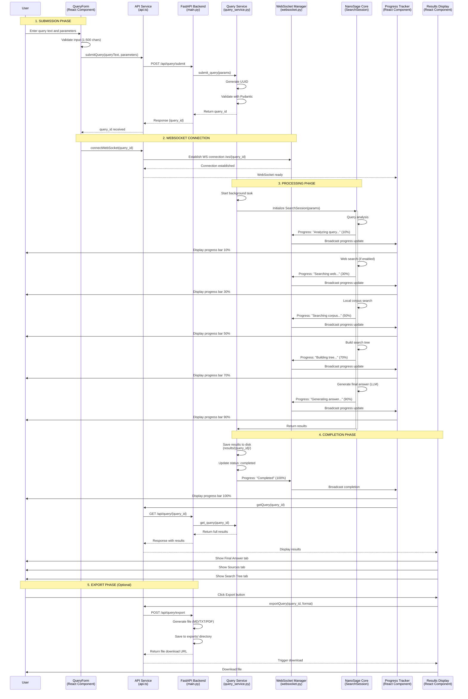
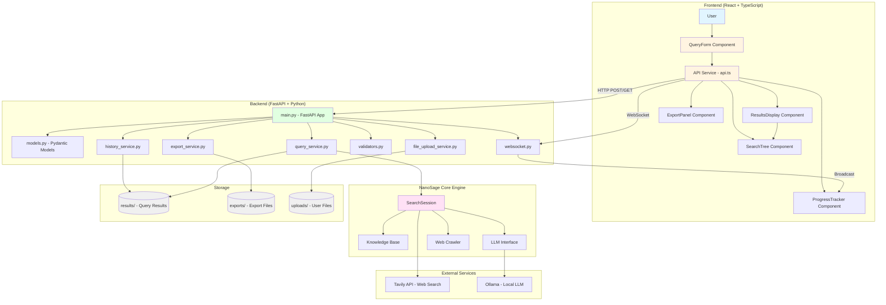
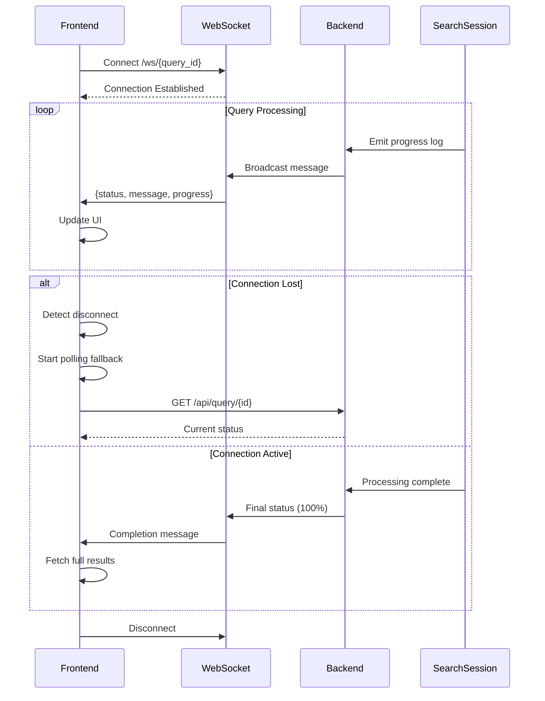
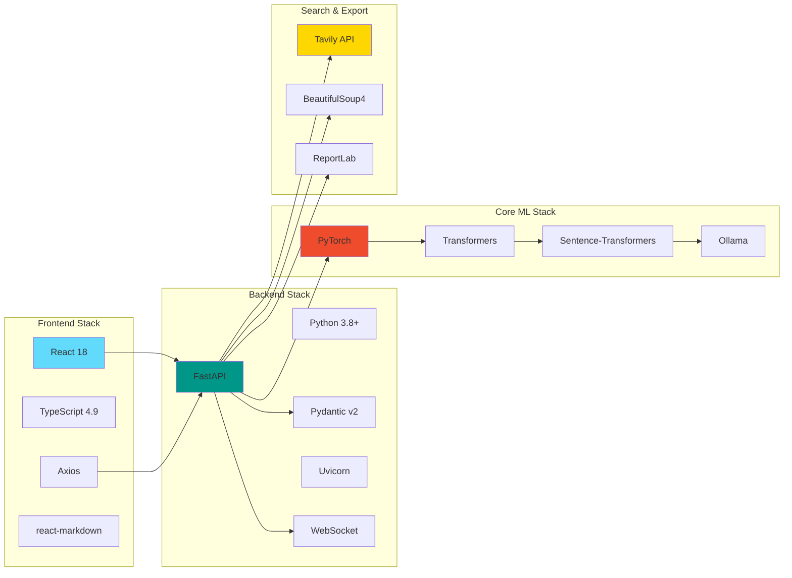

# MicroSage Query Flow Diagram

## Complete Query Processing Flow

## System Architecture Diagram

## Data Flow Overview

```mermaid
flowchart LR
    A[User Input] --> B{Validation}
    B -->|Valid| C[Generate UUID]
    B -->|Invalid| A
    C --> D[WebSocket Connect]
    D --> E[Background Processing]

    E --> F[Query Analysis]
    F --> G{Web Search?}
    G -->|Yes| H[Fetch Web Results]
    G -->|No| I[Local Search]
    H --> I

    I --> J[Build Search Tree]
    J --> K[Generate Final Answer<br/>via LLM]
    K --> L[Save Results]
    L --> M[Notify Frontend]

    M --> N[Display Results]
    N --> O{User Action}
    O -->|Export| P[Generate File]
    O -->|New Query| A
    O -->|View History| Q[Load Historical Query]

    P --> R[Download File]
    Q --> N

    style A fill:#e1f5ff
    style E fill:#ffe1e1
    style K fill:#ffe1f5
    style N fill:#e1ffe1
    style R fill:#f0f0f0
```

## WebSocket Communication Flow

## Technology Stack Integration

---

## Diagram Legend

- **Blue boxes**: User-facing components
- **Green boxes**: Backend services
- **Pink boxes**: Core processing engine
- **Gray boxes**: Storage/persistence layer
- **Yellow boxes**: External services

## Notes

1. All HTTP requests use Axios with base URL configuration
2. WebSocket provides real-time progress updates with polling fallback
3. Query processing is asynchronous using FastAPI background tasks
4. Results are persisted to disk in `results/{query_id}/` directory
5. Export files are generated on-demand and saved to `exports/` directory
